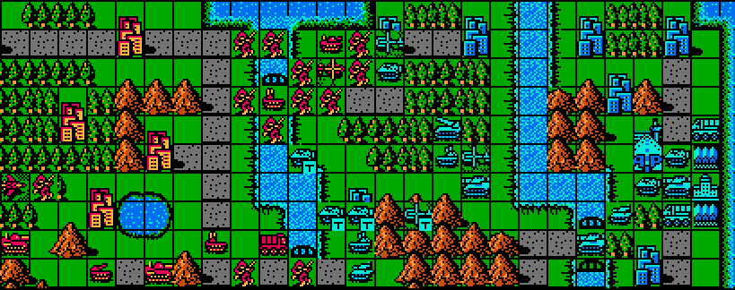
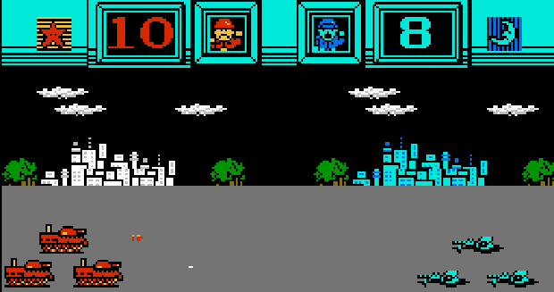
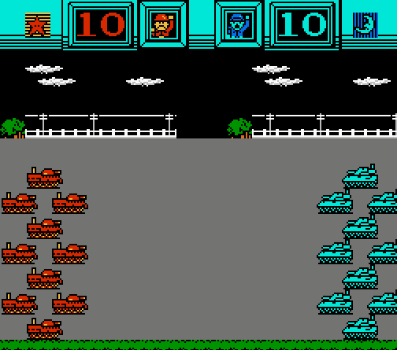
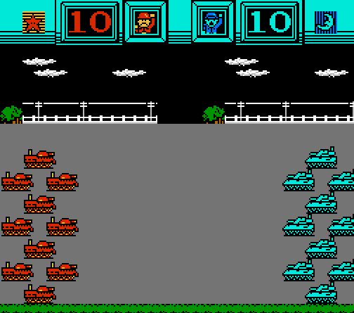
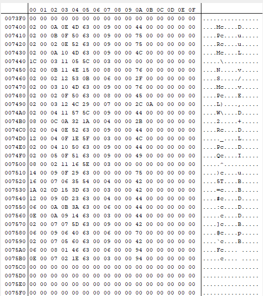
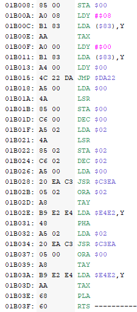
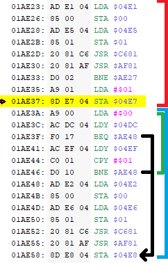
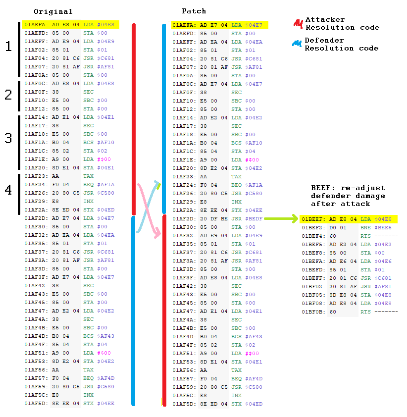
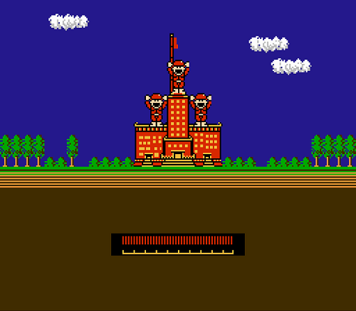

# Famicom Wars - First Strike

<p align="center">
  
</p>

This repo contains the patch for the NES game Famicom Wars, which implements "First Strike". This means that attacking units deal damage to defenders first, as opposed to simultaneous damage. This significantly helps alleviate the game from turning into a tedious slog.

## **Installation**  <a id="installation"></a>
To install the patch, follow these steps:
* Have a copy of the Famicom Wars .NES file (*These steps will override the existing file, so make sure to copy the original if you wish to have a vanilla version of the ROM*)
* Download the patch `Famicom_Wars-First_Strike.ips` from this repository
* Download [Lunar IPS](https://www.romhacking.net/utilities/240/), a program which can be used to apply the patch
* Run Lunar IPS
    * Select "Apply IPS Patch"
    * Locate the Famicom_Wars-First_Strike.ips file
    * Next, Locate the vanilla Famicom Wars .NES file (again, I suggest making a copy beforehand)
* Load the newly-patched ROM (.NES file) into your emulator of choice.

Note: This patch is (to my knowledge) compatible with existing translation patches. I highly recommend the [English patch](https://www.romhacking.net/translations/6828/) by Stardust Crusaders (et. al.), which I used while creating this patch.

# The Problem

<p align="center">
  
</p>

Famicom Wars has a healthy legacy that spans even to this day, notably for being the fist entry in the *Wars* series. This eventually begat Advance Wars, one of my favorite games - but what's remarkable is just how similar the two games are to one-another. Or rather, how two games can be so similar to one another, but play completely differently. Advance Wars is *snappy* - units hit harder, there's CO powers to turn the tides, and playing against the CPU is *at least* an order of magnitude faster. Indeed, Advance Wars has the benefit of being made in the future, both on better hardware after a handful of sequels, this is certainly no fault to Famicom Wars. However, if I had to pick *one thing* that totally turns me off from playing Famicom Wars, it would be that most games turn into a total quagmire. 

Restated, Famicom Wars lacks *momentum*. Without momentum, units tend to pile up in the middle of the map, unable to make a real dent in one side or the other. The root of the issue, from my perspective, is that damage is done simultaneously. When you attack, you are punished; an infantry attacking another infantry means that both sides will roughly take 45% damage, minus their terrain bonuses. A full-HP infantry on a city will require between 3 and 4 attacking infantry to destroy it, each in turn receive chip damage (even the one which destroys it!). So you invest heavily in artillery, which only further punishes actions on either sides as breaking down "unit walls" is even harder here. 

So, with all thing combined: Simultaneous damage, stally and grindy matches, sluggish UI, even slower CPU decision making (albeit impressive for the era) - the game virtually unplayable. Even the most basic matches end up taking *hours*! Why would you ever play this over Advance Wars?

# The Solution
There are some things which are really, really hard to fix, perhaps bordering on technically impossible. Making the CPU player better or improving the UI to be a bit quicker on 1980s hardware is a fool's errand with little payoff. *But*, making one little change can have drastic consequences on the gameplay: First Strike.

The concept is fairly simple: unlike simultaneous damage, First Strike means that the attacker deals damage first, *then* the defender. This means that the damage done by the defender is less (as, their damage is proportional to their HP). 

<center>

| <p style="text-align: center;">Original</p> | <p style="text-align: center;">First Strike</p> |
|---|---|
| <br/>| |
| <p style="text-align: center;"> Attacker (Red) gains no advantage. </p> | <p style="text-align: center;"> Attacker (Red) gains an advantage. </p>|

</center>

The results speak for themselves; now there is an advantage to attacking your opponent. Now, there are consequences for careless troops deployment. Now there is *momentum*.

# Technical Details
When I do these patches, the technical work swings somewhere between "Writing lots of 6502" or "Reading lots of 6502"; in this case it was the latter. This was an investigation - my notes go on and on, walking through several different sections of the code, trying to figure out wtf is going on. In the end, the actual patch is largely moving or copying existing code, and adding only a tiny bit (like 6 Opt Codes). I was able to do this because I had a good understanding of what was happening, and what I wanted to change.

## The goal
Instead of "simultaneous" damage, I wanted:

- The attacker attacks first, and the defender gets damaged
- After the defender is damaged:
    - If they're dead, do nothing
    - Else, deal damage to the attacker proportional to the defender's health

## Investigation
As stated, most of the work was around orienting myself in the code. This section loosely details that process.

### Where to begin
I knew roughly what I was looking for; I wanted to figure out where the damage was being calculated. But to find that, I would need to know where the unit data was stored. I could imagine a few properties in my head: The unit entity would certainly have current HP, fuel, ammo, x/y location on the grid, etc. But finding that data is looking for a needle in the haystack. I knew that games often moved working memory to the "zero page" (between $00 and $FF in RAM) so that working with it was faster, however I wasn't seeing anything that promising. Turns out, damage calculation did have an "intermediate location" - between `$04Dx` and `$04Ex`. After watching the battle animation a few times, I started to notice that some of these values effected the outcome (more on that later). But, I was still unsure where the units were located. After some more sluting, eventually I found out.

### My Units, Your Units

<p align="center">
  
</p>

Way in the back starting at `$7400` is where player 1's units are stored, while player 2's units are stored in `$7700`. After poking the values quite a bit, I found out some stuff. First off, it's a list of units; each row represents a unit (I have 26 of them in my army). Each column is the value of a different property: for example, column $00 is the type of the unit. A value of $02 means that the unit is an infantry for player 1, and a value of $03 also represents an infantry, but for player 2. Out of curiosity, I mapped out a few values more values:

| ID | Unit |
|---|---|
| $02 | Infantry |
| $04 | Engineer (Mech) |
| $06 | Tank A (big) |
| $08 | Tank A (little) |
| $0A | APC |
| $0C | Artillery A (big) |
| $0E | Artillery B (little) |
| $10 | Missiles |
| $12 | Flack Gun (AA) |
| $14 | Supply Truck |

Adding $01 to each of these values would produce the same unit, but for player 2. Why does it start at $02 instead of $00? Well it has to do with the damage lookup.

Anyways, there are some other properties as well, but the most useful is located at $05: the unit's HP. Interestingly, a fully healed 10-hp unit is represented as $63, which has a decimal value of 99. In my initial search, I was looking for $0A (decimal: 10), but it makes a lot more sense that the number is a bit more "granular". Anyways, I found an address to listen to: I could set a breakpoint on a particular unit's HP (e.g. `$7405`), engage that unit in combat, and see where it leads. So, I did.

### The Combat Calculation function

Not surprisingly, the meat of the war game is about determining the damage done between two units. Attaching a breakpoint on one of those units health and walking back from it, I certainly found what I was looking for. I don't actually know for certain where it begins (nor is it particularly relevant for me) but to give some sense of scope, it starts somewhere around `$01ADXX` (possibly earlier) and goes to `01AF90`. Its a lot of code, but it's relatively straightforward. 

As I mentioned earlier, the "data" concerning the two combating units is stored in both  `$04DX` and `$04EX`, but the `E` row is a bit more relevant. For example, the attacking unit's HP is read from the `$7XX5` location (depending on whether it's player 1 or 2) and stored at `$04E1`, while the defending unit's HP is stored at `$04E2`. The rest of the row (thankfully) maintains this attacker value / defender value back-and-forth. Skipping ahead, we see something very exciting: 

### The Damage Lookup Table

<p align="center">
  <br/>
  Wow.
</p>

This code determines how much damage the units do to each other, not adjusted for their health. The first time I saw this I had no idea what it was doing, but I knew that at the end the Accumulator stored the damage of the attacker, while the X register stored the damage done by the defender. Lets walk through this:

Setup: player 1's Tank B attacked player 2's infantry. The IDs for these units are `$08` for player 1's tank B, and `$03` for player 2's infantry. Before this function call, these values were stored in the addresses `$00` and `$02`, respectively.

```
LDA $00    ; Loads $08 into acc (attacker's tank unit)
LSR        ; logical shift right, acc goes from `1000` to `0100` ($04)
STA $00    ; store $04 back to address $00 ($00: $04, $02: $03)
DEC $00    ; decrement the value at the address $00 ($00: $03, $02: $03)
LDA $02    ; loads $03 to acc
LSR        ; logical shift right, acc goes from `0011` to `0001`
STA $02    ; store acc in $02 ($00: $03, $02: $01)
DEC $02    ; decrement $02 ($00: $03, $02: $00)
LDA $00    ; load $00 back into acc ($03)
JSR $C3EA  ; subroutine that calls ASL 4 times
           ; so, acc is $03, which is 0000 0011
           ; ASL 1: 0000 0110
           ; ASL 2: 0000 1100
           ; ASL 3: 0001 1000
           ; ASL 4: 0011 0000
		       ; The processed attacker byte was shifted from low to high, which effects the value looked up in the table.
ORA $02    ; this combines the processed attacker unit value with the processed defender unit value.
           ; $02 is zero, but if you OR them, you'd end up with <$00,$02>:
           ; result => 0011 0000 ($30)
TAY		     ; this processed value is transferred to Y
LDA $E4E2,Y; $E4E2 + $30 => $E512, which is $37
           ; To explain these values:
           ; $E4E2 is the beginning of the damage lookup table. 
           ; We add the <attacker id, defender id> composite to it, which jumps to the "tank damage" row, and the "infantry" column
           ; $37 (decimal: 55) is the amount of damage a tank does to an infantry unit.
PHA        ; Pushes the accumulator to the stack ($37)
           ; At this point, we do the same-but-opposite: we look up the damage the infantry does to the tank.
LDA $02    ; Loads defender unit (infantry)
JSR $C3EA  ; Performs the same shift on them (which, results in ASL x4 $00 => $00)
ORA $00    ; combines it with the attacker (tank B) unit 
           ; 0000 0011 ($03)
TAY        ; Y becomes $03
LDA $E4E2,Y; loads $E4E5 + $03 => $0F (decimal 15), which is the damage the infantry does to tanks.
TAX        ; puts $0F into X
PLA        ; Pull accumulator from stack ($37)
RST        ; returns with the damage each unit will receive
```

So, acc holds $37 (damage tank B does to an infantry), and X holds $0F (the damage an infantry does to Tank B).

These values are then stored in `$04E5` (attacker) and `$04E6` (defender).

### Damage Adjustment

We have the attacker and defenders HP, and the damage they do to one another; the next important piece is calculating the *actual* damage that the unit can do. The damage done is proportional to the units HP: 100% HP means 100% damage, 75% HP => 75% damage, etc. This logic is done around 01AE23, first for the attacker, then for the defender:

<p align="center">
  <br/>
</p>

I won't walk through this one, but I'll roughly explain what the sections are doing. 

The red section is the adjustment logic for the attacker. The attacker's HP and Damage values are loaded into addresses `$00` and `$01`, respectively. Then, they're pumped through two \~Magic\~ sub routines (`$C681` and `$AF81`), and the adjusted damage ends up in `$01`. 

Now these two \~Magic\~ sub routines show up a few times in here, and they're rather complex and im unsure how they work. After walking through them (twice), I still don't quite get it - but basically, given inputs N and M, it returns a rato of M equal to N / 100. So, if a unit has 50% hp (N) and does $40 damage (M) at full HP, you would get a result of (roughly*) `$20`. This attacker adjusted damage is then stored in `$04E7`.

(*This is pure speculation, but I think this is also responsible for the "luck" roll. Without going too deep into the details, the N factor will generally produce a higher number if it has more 1s in it, especially in the higher digits (e.g. #63 = 0110 0011). I could experiment with this, but I'm tired and hungry and I'll leave it at that.)

Anyway The blue section concerns the adjusted attack for the defender, and functionally it's mostly identical to the Attacker's, but with one slight difference. The Green section does some checks against two fields: `$04DC`, and `$04DF`. Now, when the attacker attacks the defender, this is done via the UI by selecting a unit within range, and at that point, the ammo of the attacker is checked. Meaning, as a prerequisite to even getting to this logic, the attacker must have had ammo, and the unit must have been in range. But for the defender to counter-attack, *they* must have similar checks - and this is that green section. The defender's ammo is checked at `$04DC` (*?*\*), and if it's zero, then the value $0 is stored to the defender's adjusted damage in `$04E8`. Likewise, if the attacker is an indirect unit (`$04EF`)(*?*\*), again, the counter-attack damage is $0. This turns out to be a very useful detail when doing the actual code change for this patch: If the defender cannot attack (and therefore does not shoot in the animations, etc.), then their adjusted damage value is $0.

(\*I don't actually recall for certain if these addresses correspond to those actual things, but I'm *pretty sure* and I'm tired and hungry and I'll leave it at that.)

So; we know the *actual* damage the attacker and defender will do, *and* we know which lines of code to invoke to calculate the adjusted damage. This may be useful in, say, determining how much damage a defender can do after they've been *attacked first*.

### Combat Resolution

Finally, we get to where the combat is resolved, and where the code change actually occurs. I'll attempt to explain both at once:

<p align="center">
  <br/>
</p>

On the left-hand side is the original code, and on the right the code change for this patch. We'll first explore the left side to get acquainted with the code. As said earlier, damage is done simultaneously, and it just so happens that the attacker is resolved first, and the steps are as follows:

1. The adjusted damage done by the defender `$04E8` and the terrain defense for the attacker `$04E9` (omitted from this writeup) are loaded. These two values go through the \~Magic\~ SRs (`$C681` and `$AF81`), and the adjusted defense value is produced in $00. 
    - I really don't know why this is necessary
1. The adjusted damage done by the defender `$04E8` is again loaded. The adjusted attacker defense value at $00 is subtracted from the adjusted defender damage, and the result (final damage value) is stored in $00.
1. The attacker's HP is loaded `$04E1`, and now the final damage value is subtracted from the attacker's health. 
    - If there was any overkill, the attacker's HP is just set to 0.
1. Finally, the attacker's HP value is converted to a number between 0 and 10, rounded up (e.g. 76% HP => 8 HP)

For the defender, the same is done, but the opposite.

Now, in order to do First Strike, the order needs to be reversed, and the defender's adjusted damage value needs to be updated *after* their HP reduced. What's neat about this change is that the vast majority of the code is just moved around. On the right side, this is clear: the defender is resolved first, then the attacker. The code is identical except, instead of loading the defender's adjusted damage value (`LDA $04E8`), the code jumps to the (`01BEEF`) sub routine to re-calculate the damage value. 

In BEEF, most of the code is copied (see the Damage Adjustment section above), however a little guard-clause was added in the beginning. That clause checks if the defender's adjusted damage is already zero - and if so, just return. Recall that if the adjusted damage value was already zero, it means that the defender couldn't counter-attack (e.g. out of ammo, attacker was an indirect). But just the same, if the damage received from the attacker is enough to destroy the defender, then the adjusted damage value would return zero anyway. Once this value is calculated, then the combat resolves for the attacker, and then combat is complete.

# Conclusion
<p align="center">
  <br/>
</p>

I've made patches in the past to improve old games (see: [Fantastic Adventures of Dizzy: Fair Edition](https://github.com/schil227/FantasticAdventuresOfDizzyFair), [Journey To Silius: Fair Edition](https://github.com/schil227/JourneyToSiliusFair)), but I am especially pleased with this one. While those patches were focused on tweaking the difficulty to make the game more fun, this one's focus is to make it more engaging. Indeed, after playing a few matches, I found myself enjoying the game a lot more.

That said, this patch doesn't make the game *perfect*. There are other things which contribute to the tedium, beyond the slow AI and clunky UI. For example, there are some dubious unit match-ups: a bomber does a pathetic 50% damage to infantry, while infantry (some dudes literally standing on the f****** ground) do 5% damage. Apples to apples, the bomber has done 500G damage to the infantry, and the infantry has done 1000G damage to the bomber. That's ridiculous... but at least with this patch, the trade-off is an even 500G (still ridiculous). 

There is a [thriving community](https://awbw.amarriner.com/) which, in recent years, has seen a dramatic increase in the number of players interested in Advance Wars. In that vein, I think there's a general curiosity to experience the very first game in the series. This patch improves it, and makes it a lot more palatable to "modern" players. However, I think that a few more tweaks would really make this game shine. That said, I'll keep this change as a stand-alone patch, because a part of me really enjoys the "weirdness" of Famicom Wars, and I think those who dig into the past would enjoy it as well.

In the future, I may make a follow up patch to this; but until then, enjoy.
